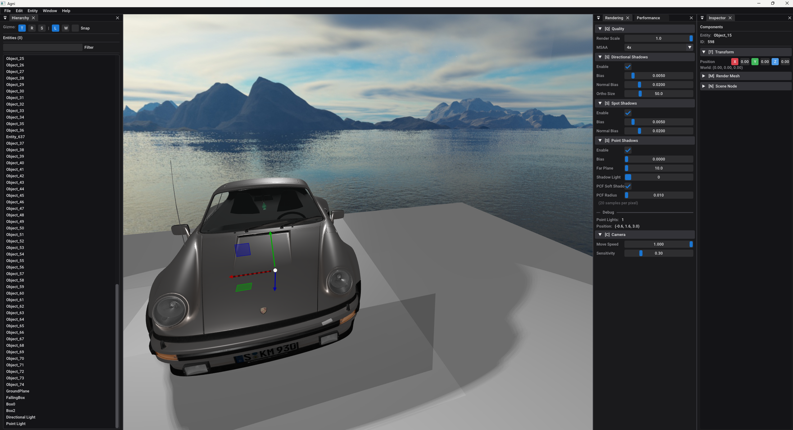

# Agni

My personal Game Engine featuring bleeding-edge Vulkan 1.4, physically-based rendering, entity-component-system architecture, and integrated physics simulation.

## Progress



## Features

### Rendering
- Vulkan 1.4 with dynamic rendering and bindless resources (descriptor buffers)
- Physically-Based Rendering (PBR) with metallic-roughness workflow
- Shadow mapping for directional, spot, and point lights with optional PCF soft shadows
- glTF 2.0 model loading with automatic material extraction
- Multi-light support (up to 256 point lights, 64 spot lights)
- Skybox rendering and compute shader effects
- Frustum culling and configurable MSAA (1x/2x/4x/8x)
- Object picking for viewport entity selection

### Entity-Component-System (ECS)
- Data-driven architecture using [Flecs](https://github.com/SanderMertens/flecs)
- Transform hierarchy with dirty flag optimization
- Modular systems: RenderSystem, LightSystem, PhysicsSystem
- EntityFactory for converting glTF scenes to ECS entities

### Physics
- [Jolt Physics](https://github.com/jrouwe/JoltPhysics) integration for 3D simulation
- Rigid body support (static, dynamic, kinematic)
- Collider shapes: box, sphere, capsule
- Physics system syncs transforms to ECS

### Editor & Tools
- Dark modern theme with professional UI styling
- Scene hierarchy and component inspector with real-time editing
- Entity creation via menus and context menus (right-click)
- Transform gizmos ([ImGuizmo](https://github.com/CedricGuillemet/ImGuizmo)) for translate/rotate/scale operations
- Keyboard shortcuts (Delete, Escape, etc.)
- Performance monitor and rendering settings windows
- Tracy Profiler integration for real-time performance analysis
- RenderDoc support for graphics debugging

## Building

### Prerequisites
- C++20 compatible compiler (MSVC 2022 or later, GCC, Clang)
- CMake 3.26 or later
- Python 3.x
- Git

### Quick Start (Recommended)

**Easy build using Python script:**
```bash
# Clone with submodules
git clone --recursive https://github.com/vishwah13/Agni.git
cd Agni

# Build the engine
python build.py
```

If you already cloned without `--recursive`, initialize submodules:
```bash
git submodule update --init --recursive
```

**Build script options:**
```bash
python build.py                 # Debug build + Tracy profiler (default for development)
python build.py --release       # Release build (optimized, no Tracy profiler)
python build.py --clean         # Clean and rebuild
python build.py --tracy         # Force build Tracy profiler (auto in Debug)
python build.py --no-shaders    # Skip shader compilation (use pre-compiled)
python build.py --no-tracy      # Disable Tracy profiling
python build.py -j 8            # Use 8 parallel jobs

# Generator options:
python build.py -G vs2022       # Use Visual Studio 2022
python build.py -G vs2026       # Use Visual Studio 2026
```

> **Note:** Debug builds automatically build the Tracy profiler viewer for easy profiling during development. Release builds skip the profiler unless `--tracy` is specified.

### Manual Build Instructions

If you prefer to use CMake directly:

1. **Configure:**
   ```bash
   cmake -S . -B build -DCMAKE_BUILD_TYPE=Release
   ```

2. **Build:**
   ```bash
   cmake --build build --config Release --parallel
   ```

3. **Run the engine:**
   ```bash
   ./bin/Release/engine.exe    # Windows
   ```

### Build Options

| Option | Default | Description |
|--------|---------|-------------|
| `AGNI_COMPILE_SHADERS` | `ON` | Compile shaders to SPIR-V. Set to `OFF` to use pre-compiled `.spv` files |
| `AGNI_ENABLE_TRACY` | `ON` | Enable Tracy profiler integration. Set to `OFF` for production builds |
| `AGNI_ENABLE_JOLT` | `ON` | Enable Jolt Physics integration |

## Shader System

Agni uses [Slang](https://github.com/shader-slang/slang) for shader compilation:

- **GLSL shaders** (`.vert`, `.frag`, `.comp`) are compiled using glslang (bundled with Slang)
- **Slang shaders** (`.slang`) can be used for advanced features like generics, interfaces, and automatic differentiation
- Pre-compiled SPIR-V files (`.spv`) are included for CI/CD builds

See [docs/ShaderCompilation.md](docs/ShaderCompilation.md) for detailed documentation.

## Dependencies

All dependencies are included as git submodules in `third_party/`:

| Library | Purpose |
|---------|---------|
| [Slang](https://github.com/shader-slang/slang) | Shader compiler (includes glslang) |
| [SDL3](https://github.com/libsdl-org/SDL) | Windowing and input |
| [Vulkan-Headers](https://github.com/KhronosGroup/Vulkan-Headers) | Vulkan API headers |
| [volk](https://github.com/zeux/volk) | Vulkan function loader |
| [vk-bootstrap](https://github.com/charles-lunarg/vk-bootstrap) | Vulkan initialization helper |
| [VMA](https://github.com/GPUOpen-LibrariesAndSDKs/VulkanMemoryAllocator) | Vulkan memory allocation |
| [glm](https://github.com/g-truc/glm) | Mathematics library |
| [ImGui](https://github.com/ocornut/imgui) | Immediate mode GUI (docking branch) |
| [ImGuizmo](https://github.com/CedricGuillemet/ImGuizmo) | 3D transform gizmos |
| [fastgltf](https://github.com/spnda/fastgltf) | glTF 2.0 loader |
| [stb_image](https://github.com/nothings/stb) | Image loading |
| [mikktspace](https://github.com/mmikk/MikkTSpace) | Tangent space computation |
| [fmt](https://github.com/fmtlib/fmt) | String formatting |
| [Flecs](https://github.com/SanderMertens/flecs) | Entity-Component-System |
| [Jolt Physics](https://github.com/jrouwe/JoltPhysics) | 3D physics simulation |
| [Tracy](https://github.com/wolfpld/tracy) | Real-time profiler |

## Performance Profiling with Tracy

Agni integrates [Tracy Profiler](https://github.com/wolfpld/tracy) for real-time performance analysis. Tracy provides detailed frame timing, CPU profiling zones, and memory tracking with minimal overhead.

### Build Options

| Option | Default | Description |
|--------|---------|-------------|
| `AGNI_ENABLE_TRACY` | `ON` | Enable Tracy profiler integration |

**Disable Tracy (for production builds):**
```bash
cmake -B build -DAGNI_ENABLE_TRACY=OFF
cmake --build build --config Release
```

### Building the Tracy Profiler Viewer

**Automatic (with build script):**
```bash
# Debug builds automatically build Tracy profiler
python build.py

# Release builds can optionally build Tracy
python build.py --release --tracy
```

**Manual build (if needed):**
```bash
# Configure the Tracy profiler build
cmake -B third_party/tracy/profiler/build -S third_party/tracy/profiler -DCMAKE_BUILD_TYPE=Release

# Build the profiler (this may take a few minutes on first build)
cmake --build third_party/tracy/profiler/build --config Release --parallel
```

The profiler executable will be located at:
- **Windows:** `third_party/tracy/profiler/build/<Debug|Release>/tracy-profiler.exe`

### Using Tracy Profiler

After building in Debug mode (which automatically builds the profiler):

1. **Launch the Tracy profiler viewer:**
   ```bash
   # Debug build
   ./third_party/tracy/profiler/build/Debug/tracy-profiler.exe

   # Or Release build (if built with --release --tracy)
   ./third_party/tracy/profiler/build/Release/tracy-profiler.exe
   ```

2. **Run the Agni engine:**
   ```bash
   ./bin/Debug/engine.exe      # Debug build
   ./bin/Release/engine.exe    # Release build
   ```

3. **Connect in Tracy:**
   - The Tracy viewer will automatically detect your application
   - Click **"Connect"** to start profiling
   - View real-time performance data in the timeline

### Available Profiling Zones

Agni includes comprehensive profiling instrumentation:

| Zone | Description |
|------|-------------|
| `FrameMark` | Frame boundaries for FPS analysis |
| `renderFrame` | Total frame rendering time |
| `drawGeometry` | Geometry rendering with sub-zones: |
| ├─ `Frustum Culling` | Visibility testing performance |
| ├─ `Sort Opaque` | Opaque surface sorting |
| ├─ `Sort Transparent` | Transparent surface sorting (back-to-front) |
| ├─ `Draw Opaque` | Opaque geometry rendering |
| ├─ `Draw Transparent` | Transparent geometry rendering |
| └─ `Draw Skybox` | Skybox rendering |
| `drawBackground` | Compute shader background effects |
| `drawImgui` | ImGui UI overlay rendering |
| `updateScene` | Scene graph updates and transforms |
| `Camera::update` | Camera movement and rotation |
| `loadGltf` | Asset loading (with file path annotations) |

### Version Compatibility

**Important:** The Tracy client (integrated in the engine) and server (profiler viewer) must use the same version to communicate successfully. Agni uses Tracy v0.13.1.

## Troubleshooting

- **Submodule issues:** Run `git submodule update --init --recursive` to ensure all submodules are properly initialized
- **Shader compilation errors:** Ensure your GLSL shaders have `#extension GL_GOOGLE_include_directive : require` if using `#include`
- **Long build times:** First build takes longer due to Slang compilation. Subsequent builds are faster with ccache/sccache support

## License

Apache 2.0
