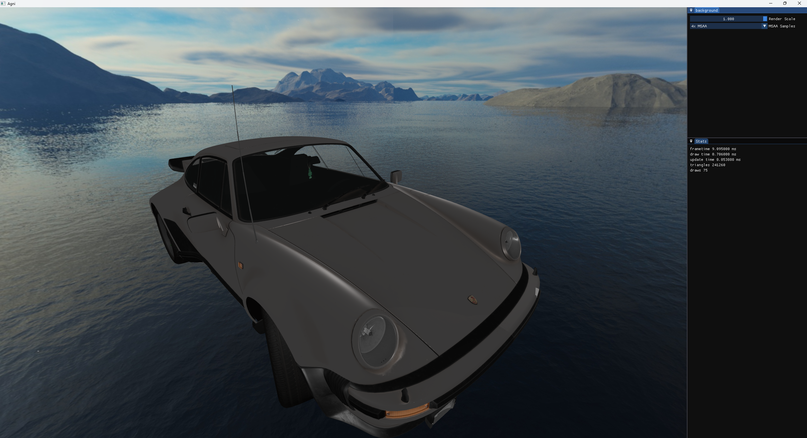
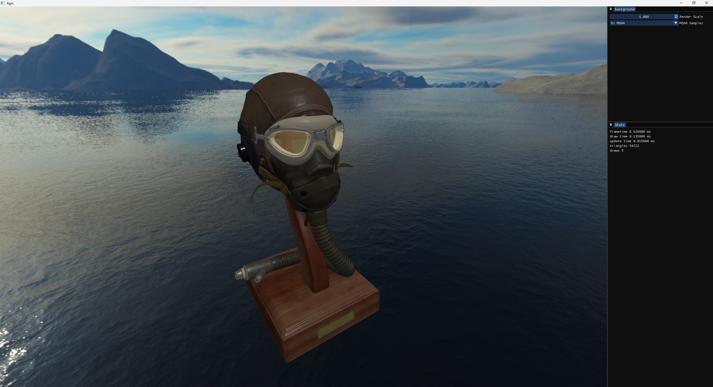

# Agni
My personal Vulkan renderer

## Progress





## Features

- Modern Vulkan rendering with dynamic rendering (VK_KHR_dynamic_rendering)
- Physically-Based Rendering (PBR) with metallic-roughness workflow
- glTF 2.0 model loading
- Skybox rendering with cubemaps
- Compute shader effects (gradients, raymarching, procedural sky)
- ImGui integration with docking support
- Frustum culling for performance optimization
- MSAA (4x) anti-aliasing

## Building

### Prerequisites
- C++20 compatible compiler (MSVC 2022 or later, GCC, Clang)
- CMake 3.26 or later
- Python 3.x
- Git

### Build Instructions

1. **Clone the repository with submodules:**
   ```bash
   git clone --recursive https://github.com/yourusername/Agni.git
   cd Agni
   ```

   If you already cloned without `--recursive`, initialize submodules:
   ```bash
   git submodule update --init --recursive
   ```

2. **Configure and build:**

   **Windows (Visual Studio):**
   ```bash
   cmake -S . -B build
   cmake --build build --config Release
   ```

   **Linux/macOS:**
   ```bash
   cmake -S . -B build -DCMAKE_BUILD_TYPE=Release
   cmake --build build
   ```

3. **Run the engine:**
   ```bash
   ./bin/engine
   ```

### Build Options

| Option | Default | Description |
|--------|---------|-------------|
| `AGNI_COMPILE_SHADERS` | `ON` | Compile GLSL shaders to SPIR-V. Set to `OFF` to use pre-compiled `.spv` files |

**Example: CI/CD build (faster, skips shader compilation):**
```bash
cmake -B build -DAGNI_COMPILE_SHADERS=OFF
cmake --build build --config Release
```

## Shader System

Agni uses [Slang](https://github.com/shader-slang/slang) for shader compilation:

- **GLSL shaders** (`.vert`, `.frag`, `.comp`) are compiled using glslang (bundled with Slang)
- **Slang shaders** (`.slang`) can be used for advanced features like generics, interfaces, and automatic differentiation
- Pre-compiled SPIR-V files (`.spv`) are included for CI/CD builds

See [docs/ShaderCompilation.md](docs/ShaderCompilation.md) for detailed documentation.

## Dependencies

All dependencies are included as git submodules in `third_party/`:

| Library | Purpose |
|---------|---------|
| [Slang](https://github.com/shader-slang/slang) | Shader compiler (includes glslang) |
| [SDL3](https://github.com/libsdl-org/SDL) | Windowing and input |
| [Vulkan-Headers](https://github.com/KhronosGroup/Vulkan-Headers) | Vulkan API headers |
| [volk](https://github.com/zeux/volk) | Vulkan function loader |
| [vk-bootstrap](https://github.com/charles-lunarg/vk-bootstrap) | Vulkan initialization helper |
| [VMA](https://github.com/GPUOpen-LibrariesAndSDKs/VulkanMemoryAllocator) | Vulkan memory allocation |
| [glm](https://github.com/g-truc/glm) | Mathematics library |
| [ImGui](https://github.com/ocornut/imgui) | Immediate mode GUI (docking branch) |
| [fastgltf](https://github.com/spnda/fastgltf) | glTF 2.0 loader |
| [stb_image](https://github.com/nothings/stb) | Image loading |
| [fmt](https://github.com/fmtlib/fmt) | String formatting |

## Troubleshooting

- **Submodule issues:** Run `git submodule update --init --recursive` to ensure all submodules are properly initialized
- **Shader compilation errors:** Ensure your GLSL shaders have `#extension GL_GOOGLE_include_directive : require` if using `#include`
- **Long build times:** First build takes longer due to Slang compilation. Subsequent builds are faster with ccache/sccache support

## License

Apache 2.0
